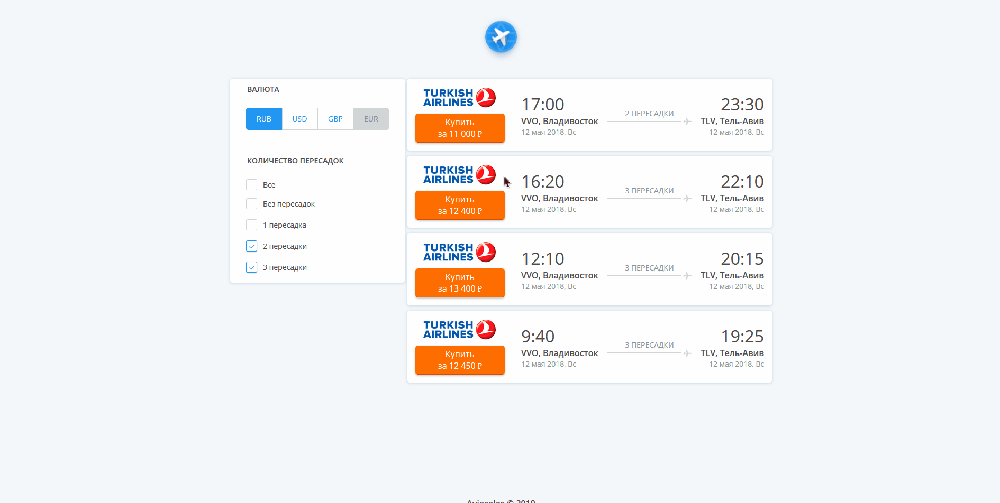

# Episode #5: Aviasales.

[На русском](README.ru.md)

**Aviasales** is application for filtering airlines tickets.

## Demo
Coming soon!

## Preview


## Intro
This is a test task for Junior Frontend Developer position. Go to the [link](https://github.com/KosyanMedia/test-tasks/blob/master/aviasales/README.md) to learn more about the task. 

## Tasks
- [x] Tickets rendering;
- [x] Filtering tickets by number of stops;
- [x] Currency switcher;
- [x] HTML markup ticket, filters, currency switcher;
- [ ] Adaptive design (include breackpoint 320px);
- [ ] Async load tickets from local json-file on application initialize.

## Libraries used
* [Create-React-App](https://facebook.github.io/create-react-app)
* [React](https://reactjs.org)
* [Redux](https://react-redux.js.org)
* [Reselect](https://github.com/reduxjs/reselect)
* [Jest](https://jestjs.io)
* [styled-components](https://www.styled-components.com)
* [CSS Grid Layout](https://developer.mozilla.org/ru/docs/Web/CSS/CSS_Grid_Layout)

Addition links: arrow icon from [flaticon.com](https://www.flaticon.com/free-icon/up-arrow_271239), mouse cursors by [Tobias Bjerrome Ahlin](https://tobiasahlin.com/blog/common-mac-os-x-lion-cursors). Thanks dudes!

## How to install

Make sure [Git](https://git-scm.com), [Node.js](https://nodejs.org) is installed.

```bash
# Use Git and clone project from github
git clone https://github.com/championo/react-aviasales.git
# Go to the project folder
cd react-aviasales
# Install dependencies
npm install
```

**Note: You can [**download**](https://github.com/championo/react-aviasales/archive/master.zip) project as zip-file (download, unzip, run command `npm install`)**

## How to run

```bash
# Start the development server
npm start
```

In a web browser, go to the url [http://localhost:3000](http://localhost:3000).
